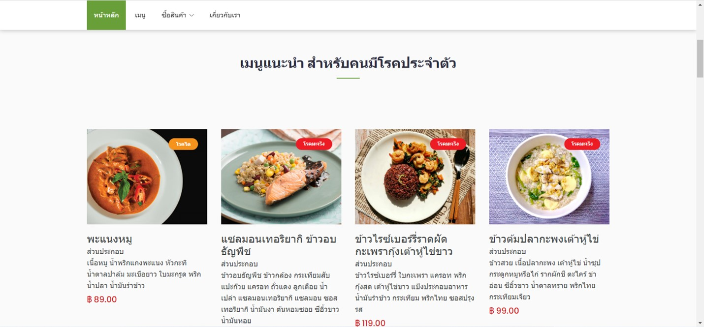
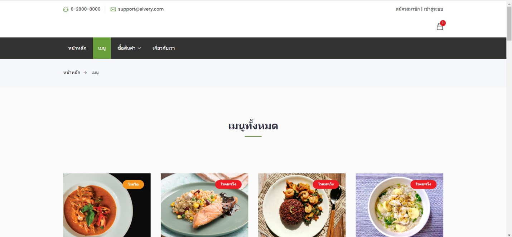
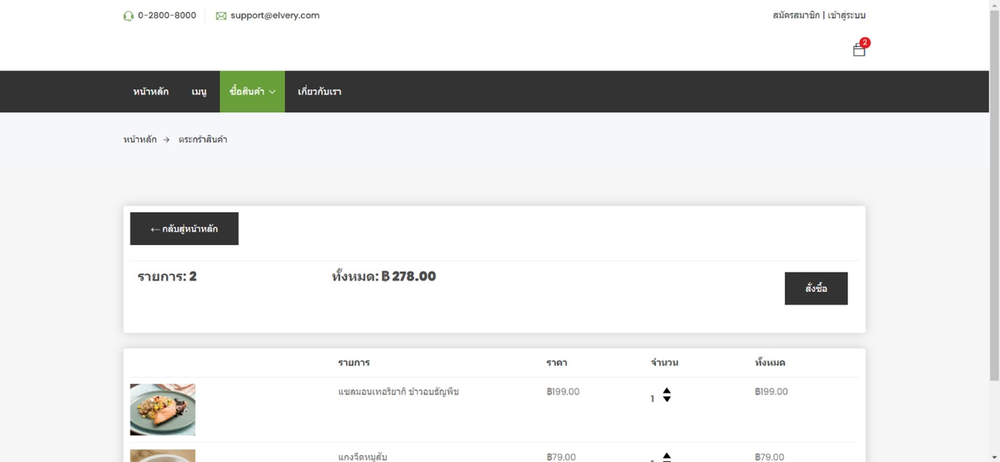
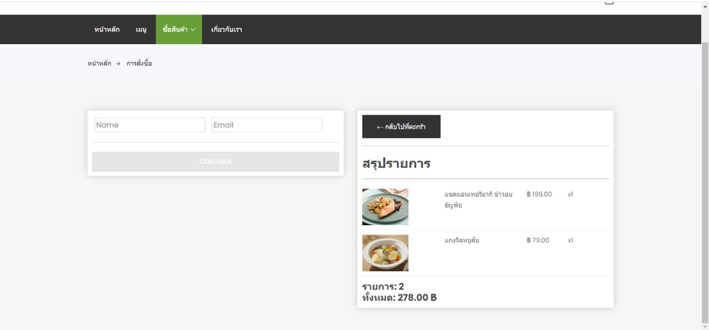
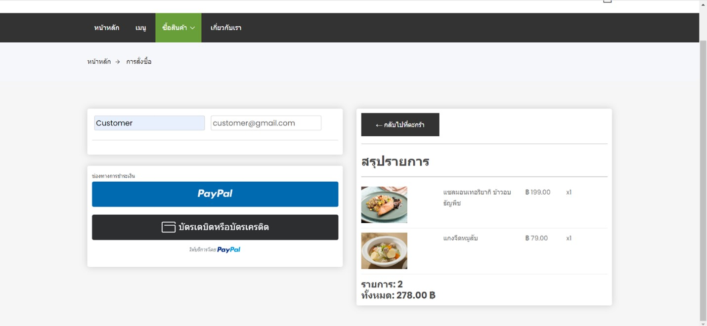
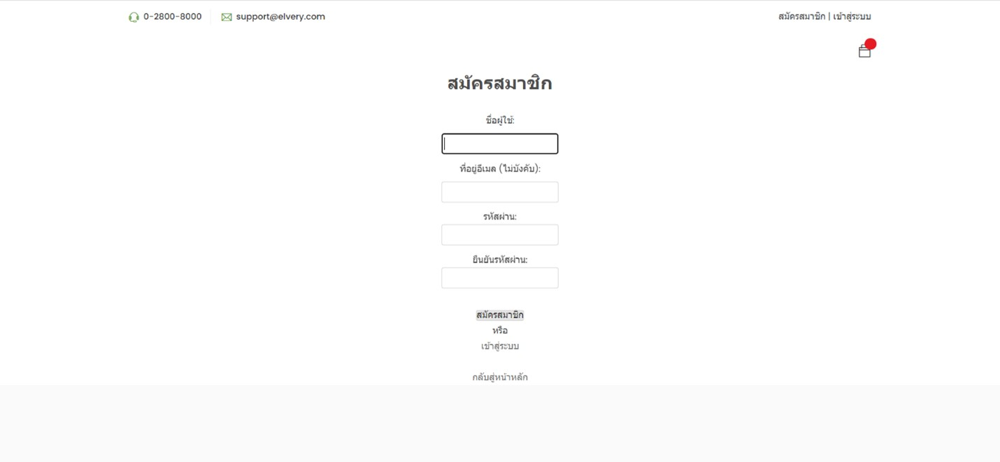
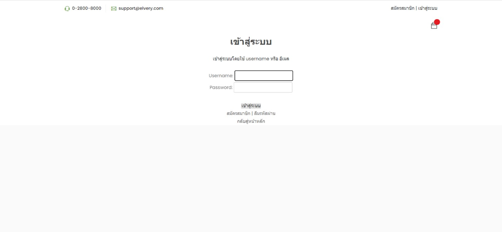

# Elvery Project
A web application for ordering meals that is
appropriate for the elderly and those with
underlying medical conditions, which was
developed using Python Django with SQLite3 for
the database and HTML, CSS, and JavaScript for
the user interface.

## Previews

  

  

  

  

  

  

  

  

  

  

